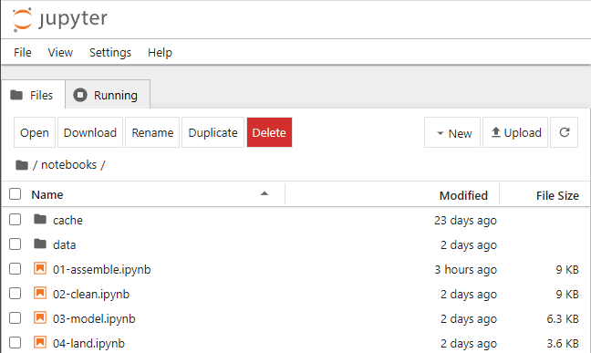
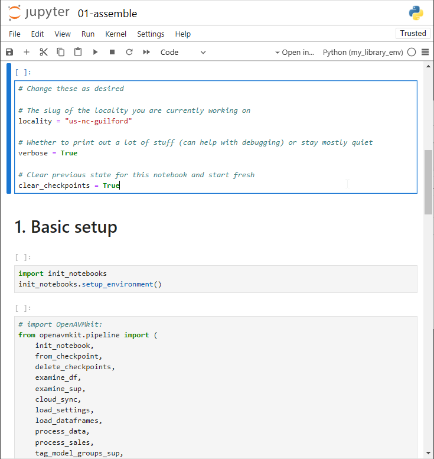

# OpenAVMKit

Open AVM kit is a python library for real estate mass appraisal. It includes modules for data cleaning, data enrichment, modeling, and statistical evaluation of predictive models. It also includes Jupyter notebooks that model typical workflows.

# Table of Contents

- [Installation](#installation)
- [Quick start](#quick-start)
- [Usage](#usage)
  - [Using the code modules](#using-the-code-modules)
  - [Using the Jupyter notebooks](#using-the-jupyter-notebooks)
- [Running tests](#running-tests)
- [Contributing](#contributing)
- [License](#license)

# Installation

Follow these steps to install and set up `OpenAVMKit` on your local environment.

## 1. Clone the Repository

Start by cloning the repository to your local machine:

_(This command is the same on Windows, MacOS, and Linux):_
```bash
git clone https://github.com/larsiusprime/openavmkit.git
cd openavmkit
```

This command will clone the repository to your local machine, store it under a folder named `openavmkit/`, and then navigate to that folder.

## 2. Set up a Virtual Environment

It's a good practice to create a virtual environment* to isolate your Python dependencies. Here's how you can set it up using `venv`, which is Python's built-in tool ("venv" for "virtual environment"):

_MacOS/Linux:_
```bash
python -m venv venv
source venv/bin/activate
```

_Windows:_
```bash
python -m venv venv
venv\Scripts\activate
```

*_On a typical computer, there will be other programs that are using other versions of python and/or have their own conflicting versions of libraries that `openavmkit` might also need to use. To keep `openavmkit` from conflicting with your existing setup, we set up a 'virtual environment,' which is like a special bubble that is localized just to `openavmkit`. In this way `openavmkit` gets to use exactly the stuff it needs without messing with whatever else is already on your computer._

Let me explain a little bit what's going on here. The first command, `python -m venv venv`, _creates_ the virtual environment. You only have to run that once. The second command, the bit that ends with `activate`, is what actually _starts_ the virtual environment. You have to run that every time you open a new terminal window or tab and want to work on `openavmkit`.

You can tell that you are in the virtual environment, because your command prompt will change to show the name of the virtual environment, which in this case is `venv`. Here's how your command prompt will look inside and outside the virtual environment.

**Outside the virtual environment:**

_MacOS/Linux:_
```bash
/path/to/openavmkit$
```

_Windows:_
```bash
C:\path\to\openavmkit>
```

**Inside the virtual environment:**

_MacOS/Linux:_
```bash
(venv) /path/to/openavmkit$
```

_Windows:_
```bash
(venv) C:\path\to\openavmkit>
```

Take careful note that you are actually inside the virtual environment when running the following commands.

When you are done working on `openavmkit` and want to leave the virtual environment, you can run this command:

```bash
deactivate
```

And you will return to your normal command prompt.

## 3. Install dependencies

## Install Python

If you don't have Python on your machine, you'll need to install it.

The specific version of Python that openavmkit has been tested on is:
> 3.12.9

You can download that version of Python [here](https://www.python.org/downloads/release/python-3129/).

If you already have Python installed, but you're not sure which version of Python you have installed, you can check by running this command:

```bash
python --version
```

If you have Python installed, you should see the version number printed to the console.

If you have the wrong version of Python installed, you can download the correct version from the link above, and then install it. Be very careful to make sure that the new version of Python is available in your `PATH`. (If you don't know what the means, here is a [handy tutorial on the subject](https://realpython.com/add-python-to-path/)).


## Install dependencies

`openavmkit` uses a bunch of third-party libraries that you need to install. Python lets us list these in a text files so you can install them with one command. Here's how you can do that, using python's built-in `pip` tool, which manages your python libraries:

```bash
pip install -r requirements.txt
```

# Quick Start

Once you've set up your python environment and dependencies, here's the basic guide to get you started:

## 1. Install `openavmkit`

If you want to import and use the code modules directly, you must install the library. 

First, make sure you've followed the above steps. 

Then, in your command line environment, make sure you are in the top level of the `openavmkit/` directory. That is the same directory which contains the `setup.py` file.

To install `openavmkit` in editable mode (so you can make changes to the library and see them reflected in your code), run this command:
  ```bash
  pip install -e .
  ```

To install `openavmkit` in normal mode, run this command:
  ```bash
  pip install .
  ```

The "." in that command is a special symbol that refers to the current directory. So when you run `pip install .`, you are telling `pip` to install the library contained in the current directory. That's why it's important to make sure you're in the right directory when you run this command!


## 2. Running Jupyter notebooks

Jupyter is a popular tool for running Python code interactively. We've included a few Jupyter notebooks in the `notebooks/` directory that demonstrate how to use `openavmkit` to perform common tasks.

To start using the Jupyter notebooks, you'll first need to have Jupyter installed. That should have already been taken care of in the requirements section above, but if you need to install it, you can do so with this command:

```bash
pip install jupyter
```

With Jupyter installed, you can start the Jupyter notebook server* by running this command:

```bash
jupyter notebook
```

_*What's a "Jupyter notebook server?" Well, a "server" is any program that talks to other programs over a network. In this case the "network" is just your own computer, and the "other program" is your web browser. When you run `jupyter notebook`, you're starting a server that talks to your web browser, and as long as it is running you can use your web browser to interact with the Jupyter notebook interface._

When you run `jupyter notebook`, it will open a new tab in your web browser that shows a list of files in the current directory. You can navigate to the `notebooks/` directory and open any of the notebooks to start running the code.

# Usage

## Using the code modules

Here's how you can import and use the core modules directly in your own Python code.

For instance, here's a simple example that demonstrates how to calculate the Coefficient of Dispersion (COD) for a list of ratios:

```python
import openavmkit

ratios = [0.8, 0.9, 1.0, 1.1, 1.2]
cod = openavmkit.utilities.stats.calc_cod(ratios)
print(cod)
```

You can also specify the specific module you want to import:

```python
from openavmkit.utilities import stats

ratios = [0.8, 0.9, 1.0, 1.1, 1.2]
cod = stats.calc_cod(ratios)
```

Or even import specific functions directly:

```python
from openavmkit.utilities.stats import calc_cod

ratios = [0.8, 0.9, 1.0, 1.1, 1.2]
cod = calc_cod(ratios)
```

## Using the Jupyter Notebooks

The `notebooks/` directory contains several pre-written Jupyter notebooks that demonstrate how to use the library interactively. These notebooks are especially useful for new users, as they contain step-by-step explanations and examples.

1. Launch the Jupyter notebook server:
```bash
jupyter notebook
```

This should open a new tab in your web browser with the Jupyter interface.


2. Navigate to the `notebooks/` directory in the Jupyter interface and open the notebook you want to run.



Double-click on your chosen notebook to open it.



For information on how to use Jupyter notebooks in general, refer to the [official Jupyter notebook documentation](https://jupyter-notebook.readthedocs.io/en/stable/).
 

## Running tests

To ensure everything is working properly, you can run the test suite. This will execute all unit tests from the `tests/` directory.

Run the tests using `pytest`:

```bash
pytest
```

This will run all the unit tests and provide feedback on any errors or failed tests.